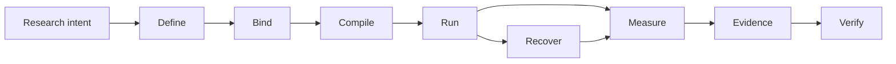

# Noetrium: Reproducible Research Infrastructure for AI Agents


<!-- readme-nav:start -->
<p align="center">
  <strong>English</strong> ·
  <a href="README.zh-CN.md">简体中文</a> ·
  <a href="README.zh-TW.md">繁體中文</a> ·
  <a href="README.ja.md">日本語</a> ·
  <a href="README.ko.md">한국어</a> ·
  <a href="README.es.md">Español</a> ·
  <a href="README.pt-BR.md">Português (Brasil)</a> ·
  <a href="README.fr.md">Français</a> ·
  <a href="README.de.md">Deutsch</a> ·
  <a href="README.ru.md">Русский</a>
</p>
<!-- readme-nav:end -->


<!-- readme-locale:en -->

<!-- readme-source-sha256:90a0951d6c336548fbcf149cc3b7e20b17c26a0a45260e9d92e87afb7b205e14 -->

<p align="center">
  <strong>Build agents. Run experiments. Verify results.</strong><br>
  A rigorous systems stack for reproducible, evidence-driven AI-agent research.
</p>

<p align="center">
  <a href="#quick-start">Quick Start</a> ·
  <a href="examples/README.md">Example</a> ·
  <a href="docs/architecture/PLATFORM_ARCHITECTURE.md">Architecture</a> ·
  <a href="docs/INDEX.md">Docs</a> ·
  <a href="#verification">Verification</a>
</p>

<p align="center">
  <a href="https://www.python.org/">=3.11" src="https://img.shields.io/badge/Python-%3E%3D3.11-3776AB?logo=python&logoColor=white"></a>
  <a href="pyproject.toml"></a>
  <a href="docs/architecture/PLATFORM_ARCHITECTURE.md"></a>
  <a href="LICENSE"></a>
</p>

<!-- readme-section:overview -->

## Overview

Noetrium is research infrastructure for long-running AI-agent experiments where execution alone is not enough: you need to know exactly what ran, under which bindings, what survived failure, and what evidence supports the result.

It spans agents, models, environments, experiments, artifacts, recovery, observability, and governance without forcing project-specific scientific meaning into the platform.

**Use Noetrium when you need:**

- reproducible experiment identity across variants, seeds, models, and environments;
- recovery that preserves effect certainty instead of guessing after crashes;
- evidence and lineage tied back to exact source and runtime identities;
- governance gates that can fail closed before publication or release.

<!-- readme-section:why -->

## Why Noetrium?

Most agent frameworks focus on how agents act or collaborate. Noetrium focuses on whether research executions remain attributable, recoverable, reproducible, and evidence-bound. It can sit underneath or alongside orchestration frameworks rather than replacing them.

### Where Noetrium fits

| Project | Primary focus | Noetrium adds |
| --- | --- | --- |
| [LangGraph](https://github.com/langchain-ai/langgraph) | Long-running stateful agent orchestration | Research identity, evidence, recovery, and governance around execution |
| [AutoGen](https://github.com/microsoft/autogen) | Multi-agent applications | Experiment protocol, reproducibility, and release evidence |
| [CrewAI](https://github.com/crewAIInc/crewAI) | Agent teams and event flows | Scientific run identity, lineage, and fail-closed recovery |
| [OpenHands](https://github.com/All-Hands-AI/OpenHands) | AI-driven software development | General research infrastructure across agents, models, and environments |
| **Noetrium** | Reproducible AI-agent research infrastructure | The research-systems layer itself |

Noetrium is deliberately broader than an agent workflow library: experiment design, model and environment identity, runtime effects, checkpoints, evidence, and release authority are treated as one research-systems problem.

<!-- readme-section:capabilities -->

## Core capabilities

- Recursive architecture — explicit ownership, narrow public APIs, typed ports, composition-time provider binding.
- Experiment infrastructure — study, run, branch, task, variant, workload, checkpoint, resume and reproducibility identities.
- Agent runtime — participant, capability, action, memory, workflow and execution boundaries without hidden global lookup.
- Model infrastructure — catalogues, revisions, qualification, serving identities, request envelopes and prompt bindings.
- Environment infrastructure — specification, lifecycle, readiness, observation, effects, snapshots and recovery.
- Process/server runtime — supervision, sessions, toolchains, remote execution, lifecycle control and journals.
- Durable data/artifacts — checksummed state, WAL recovery, lineage, retention and content-addressed evidence.
- Reliability — classified failures, effect certainty, reconciliation, replay, incidents and fail-closed recovery.
- Observability — structured logs, events, metrics, traces, diagnostics, projections and health signals.
- Governance — architecture, dependency, algorithm, concurrency, performance, forensic, release and no-degradation gates.

<!-- readme-section:architecture -->

## Architecture

The shortest mental model is an evidence-preserving research pipeline:



Every transition is expected to preserve identity or produce evidence about why it changed. Composition, Execution, and Observation remain separate authority planes; runtime code receives narrow injected ports instead of discovering providers globally.

Durable state has one owner, and uncertain external effects remain `UNKNOWN` until reconciliation proves otherwise.

`noetrium_platform/foundation/governance/system_registry/catalog.json`

<!-- readme-section:downstream -->

## Platform vs. downstream projects

This repository is an independent reusable platform package. Research methods, task suites, project-specific environment composition, experiment matrices, model choices, deployment inventories and scientific interpretation belong downstream.

```text
noetrium
        │
        ├── install as a dependency, or
        └── fork as a platform baseline
                 │
                 ▼
       downstream research repository
       ├── project-specific method
       ├── experiment composition
       ├── task/environment bindings
       └── project evidence and results
```

Downstream code consumes public platform contracts and provides project-owned implementations; the platform must not import a downstream project to decide scientific meaning or deployment policy.

<!-- readme-section:quick-start -->

<a id="quick-start"></a>

## Quick start

The first example is deterministic and requires no API key, model endpoint, or external service.

### 1. Clone and install

```bash
git clone https://github.com/Xalzeroph/noetrium.git
cd noetrium
python -m venv .venv
source .venv/bin/activate
# Windows PowerShell: .venv\Scripts\Activate.ps1
python -m pip install --upgrade pip
python -m pip install -e ".[test]"
```

### 2. Compile your first reproducible experiment plan

```bash
python examples/quickstart_experiment_plan.py
```

The example freezes a scientific protocol, binds explicit provider identities, compiles an immutable plan, and verifies its digest.

```text
study=noetrium-quickstart
variants=control,treatment
repetitions=3
protocol_digest=<sha256>
plan_digest=<sha256>
plan_consistent=true
```

### 3. Verify the checkout

```bash
research-platform-architecture-gate
python scripts/check_readme_i18n.py
```

The Python distribution metadata is named `noetrium`; the current import namespace remains `noetrium_platform` while product identity and runtime contracts evolve independently.

<!-- readme-section:containers -->

## Container workflow

A reusable Linux image and Compose definition are maintained under `deploy/`.

```bash
cp deploy/.env.example deploy/.env
docker compose -f deploy/compose.yaml config
docker compose -f deploy/compose.yaml build
docker compose -f deploy/compose.yaml run --rm platform-runtime doctor
```

The deployment layer separates immutable software from mutable runtime state; host-specific paths and secrets stay outside committed composition code.

### Bundled Minecraft provider

Minecraft is a first-party reusable environment provider. Task suites and scientific composition remain downstream.

```bash
docker compose -f deploy/compose.yaml -f deploy/compose.minecraft.yaml build platform-runtime
docker compose -f deploy/compose.yaml -f deploy/compose.minecraft.yaml run --rm platform-runtime minecraft-doctor
```

[Minecraft infrastructure](docs/infrastructure/minecraft/README.md)

<!-- readme-section:repository-layout -->

## Repository layout

| Path | Responsibility |
| --- | --- |
| `noetrium_platform/` | Reusable platform implementation and public system boundaries |
| `configs/` | Versioned configuration examples and non-secret templates |
| `deploy/` | Container image, Compose runtime and deployment bootstrap assets |
| `docs/` | Architecture, infrastructure, governance, status and history |
| `scripts/` | Thin operator, audit, release and maintenance entry points |
| `tests/` | Hierarchical regression and contract tests |
| `noetrium_platform/capabilities/environment/minecraft/` | Bundled reusable Minecraft environment provider |
| `LICENSE` / `NOTICE` / `THIRD_PARTY_NOTICES.md` | Apache-2.0 and third-party license notices |

`noetrium_platform/` is the reusable package boundary; project-specific code stays downstream.

<!-- readme-section:testing -->

<a id="verification"></a>

## Testing and verification

Run the repository regression suite and governance gates on the exact revision being evaluated.

```bash
python -m pytest -q
python scripts/architecture_gate.py
python scripts/public_contract_audit.py
python scripts/no_degradation_audit.py
python scripts/check_readme_i18n.py
```

A historical green result does not prove the current tree. Re-run the gates that matter for the exact revision you intend to publish or deploy.

The repository uses a hierarchical test taxonomy so every test belongs to an explicit contract level and release evidence can prove what was actually exercised. See `tests/TEST_SYSTEM.json`.

<!-- readme-section:principles -->

## Design principles

1. One owner per durable state.
2. Composition before execution.
3. Narrow runtime ports.
4. External effects are evidence-bearing.
5. Recovery is identity-aware.
6. No silent degradation.
7. Observation is not authority.
8. Performance changes preserve semantics.
9. Documentation moves with implementation.
10. Projects stay downstream.

<!-- readme-section:extending -->

## Extending the platform

Add a capability at the smallest owning boundary. Prefer a new provider when the public contract already exists; add a new contract only when the capability itself is new.

```text
<system>/
├── api/          public contracts and identities
├── runtime/      lifecycle and execution semantics
├── providers/    replaceable adapters owned by the system
└── composition/  provider-to-port binding
```

Avoid generic wrappers that hide unrelated algorithms, provider discovery or external effects behind one interface.

<!-- readme-section:documentation -->

## Documentation

Start with the documentation index.

### Key references

- [Documentation index](docs/INDEX.md)
- [Examples](examples/README.md)
- [Contributing](CONTRIBUTING.md)
- [Security policy](SECURITY.md)
- [Support](SUPPORT.md)
- [Citation metadata](CITATION.cff)
- [Code of Conduct](CODE_OF_CONDUCT.md)
- [Platform architecture](docs/architecture/PLATFORM_ARCHITECTURE.md)
- [Detailed system map](docs/architecture/VNEXT_DETAILED_SYSTEM_MAP.md)
- [Architecture migration contract](docs/architecture/FINAL_ARCHITECTURE_MIGRATION_CONTRACT.md)
- [Infrastructure documentation](docs/infrastructure/README.md)
- [Governance documentation](docs/governance/README.md)
- [Current status](docs/status/README.md)
- [Engineering history](docs/history/README.md)

Architecture documents define reusable ownership and contracts; status documents describe the current development tree; history preserves evidence for the state that existed when it was written.

<!-- readme-section:security -->

## Security and configuration

- Never commit passwords, private keys, access tokens, runtime secrets or machine-local credentials.
- Keep host-specific paths and secrets in ignored local profiles or environment-bound stores.
- Prefer key/agent-based unattended authentication for remote automation.
- Keep external-effect commands typed, bounded, journaled and attributable to an operation identity.
- Treat logs and evidence as potentially sensitive operational data.

<!-- readme-section:contributing -->

## Contributing

Changes should be reviewable by ownership boundary and include the tests and documentation needed to prove them.

### Before opening a pull request

```bash
python -m pytest -q
python scripts/architecture_gate.py
python scripts/check_readme_i18n.py
```

- preserve system ownership and public-contract boundaries
- add or update focused regression coverage
- update owning documentation in the same change set
- avoid unrelated refactors in the same commit
- preserve fail-closed behavior for uncertain external effects
- document intentional semantic or compatibility changes explicitly

[Documentation Change Policy](docs/governance/DOCUMENTATION_CHANGE_POLICY.md)

<!-- readme-section:license -->

## License

Noetrium is licensed under the Apache License, Version 2.0. The authoritative legal text is the root LICENSE file.

Third-party components remain governed by their own licenses; see THIRD_PARTY_NOTICES.md. Independently distributed model weights, datasets or benchmark assets may state separate terms.

[`LICENSE`](LICENSE) · [`NOTICE`](NOTICE) · [`THIRD_PARTY_NOTICES.md`](THIRD_PARTY_NOTICES.md)

<!-- readme-section:status -->

## Development status

The platform is under active architecture and runtime development.

For production, publication or scientific claims, re-run the relevant gates and inspect release evidence bound to the exact source revision rather than relying on an old green result.

Historical changes are intentionally kept out of this README; use `docs/history/` for immutable engineering records.

The current development truth is `docs/status/CURRENT_DEVELOPMENT_BASELINE.md`; release and scientific claims must be bound to exact evidence for the revision being evaluated.

`docs/status/` · `docs/history/`
