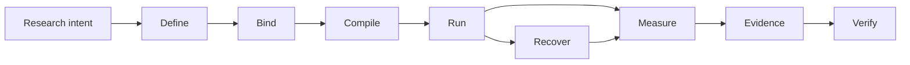

# Noetrium: Reproducible Research Infrastructure for AI Agents


<!-- readme-nav:start -->
<p align="center">
  <a href="README.md">English</a> ·
  <strong>简体中文</strong> ·
  <a href="README.zh-TW.md">繁體中文</a> ·
  <a href="README.ja.md">日本語</a> ·
  <a href="README.ko.md">한국어</a> ·
  <a href="README.es.md">Español</a> ·
  <a href="README.pt-BR.md">Português (Brasil)</a> ·
  <a href="README.fr.md">Français</a> ·
  <a href="README.de.md">Deutsch</a> ·
  <a href="README.ru.md">Русский</a>
</p>
<!-- readme-nav:end -->


<!-- readme-locale:zh-CN -->

<!-- readme-source-sha256:90a0951d6c336548fbcf149cc3b7e20b17c26a0a45260e9d92e87afb7b205e14 -->

<p align="center">
  <strong>构建 Agent。运行实验。验证结果。</strong><br>
  面向可复现、证据驱动 AI Agent 研究的严谨系统基础设施。
</p>

<p align="center">
  <a href="#quick-start">快速开始</a> ·
  <a href="examples/README.md">示例</a> ·
  <a href="docs/architecture/PLATFORM_ARCHITECTURE.md">架构</a> ·
  <a href="docs/INDEX.md">文档</a> ·
  <a href="#verification">验证</a>
</p>

<p align="center">
  <a href="https://www.python.org/">=3.11" src="https://img.shields.io/badge/Python-%3E%3D3.11-3776AB?logo=python&logoColor=white"></a>
  <a href="pyproject.toml"></a>
  <a href="docs/architecture/PLATFORM_ARCHITECTURE.md"></a>
  <a href="LICENSE"></a>
</p>

<!-- readme-section:overview -->

## 项目概览

Noetrium 是面向长时运行 AI Agent 实验的研究基础设施。对这类实验来说，仅仅“跑起来”并不够：你还需要知道究竟运行了什么、使用了哪些 binding、故障后保留了什么，以及结果由哪些 evidence 支撑。

它覆盖 Agent、模型、环境、实验、Artifact、恢复、可观测性和治理，同时不把项目特定的科学语义强塞进平台。

**当你需要以下能力时，Noetrium 最有价值：**

- 跨 variant、seed、模型和环境保持可复现的实验 identity；
- 崩溃后保留 effect certainty，而不是靠猜测决定“是否执行成功”；
- 把 evidence 与 lineage 追溯到精确 source/runtime identity；
- 在发表或发布前由 governance gate fail-closed。

<!-- readme-section:why -->

## 为什么选择 Noetrium？

多数 Agent 框架主要解决“Agent 如何行动或协作”。Noetrium 关注的是研究执行能否保持可归因、可恢复、可复现并与 evidence 绑定。它可以位于 orchestration framework 的下层或侧面，而不是把自己包装成它们的替代品。

### Noetrium 在生态中的位置

| Project | 主要关注点 | Noetrium 补充的能力 |
| --- | --- | --- |
| [LangGraph](https://github.com/langchain-ai/langgraph) | 长时、有状态 Agent orchestration | 围绕执行补上研究 identity、evidence、recovery 与 governance |
| [AutoGen](https://github.com/microsoft/autogen) | 多 Agent 应用 | 实验 protocol、reproducibility 与 release evidence |
| [CrewAI](https://github.com/crewAIInc/crewAI) | Agent team 与 event flow | 科学 run identity、lineage 与 fail-closed recovery |
| [OpenHands](https://github.com/All-Hands-AI/OpenHands) | AI 驱动的软件开发 | 跨 Agent、模型与环境的通用研究基础设施 |
| **Noetrium** | 可复现 AI Agent 研究基础设施 | Research systems layer 本身 |

Noetrium 刻意比 Agent workflow library 更宽：实验设计、模型/环境 identity、runtime effect、checkpoint、evidence 与 release authority 被视为同一个 research-systems 问题。

<!-- readme-section:capabilities -->

## 核心能力

- 递归架构 — 显式 ownership、窄公共 API、typed port 与 composition-time provider binding。
- 实验基础设施 — Study、Run、Branch、Task、Variant、Workload、Checkpoint、Resume 与可复现 identity。
- Agent 运行时 — Participant、Capability、Action、Memory、Workflow 与 Execution 边界，不依赖隐藏的全局查找。
- 模型基础设施 — catalog、revision、qualification、serving identity、request envelope 与 prompt binding。
- 环境基础设施 — specification、生命周期、readiness、observation、effect、snapshot 与 recovery。
- 进程/服务器运行时 — supervision、session、toolchain、远程执行、生命周期控制与 journal。
- 持久数据/Artifact — checksum 状态、WAL 恢复、lineage、retention 与内容寻址证据。
- 可靠性 — 故障分类、effect certainty、reconciliation、replay、incident 与 fail-closed 恢复。
- 可观测性 — 结构化日志、event、metric、trace、diagnostic、projection 与健康信号。
- 治理 — architecture、dependency、algorithm、concurrency、performance、forensic、release 与 no-degradation gate。

<!-- readme-section:architecture -->

## 架构

最短的心智模型是一条保持 evidence 的研究流水线：



每个转换都必须保留 identity，或者产生能够解释 identity 为什么变化的 evidence。Composition、Execution 与 Observation 保持为彼此独立的 authority plane；runtime 只接收窄的 injected port，而不是通过全局查找发现 provider。

每份 durable state 只有一个 owner；不确定的外部 effect 在 reconciliation 证明之前保持 `UNKNOWN`。

`noetrium_platform/foundation/governance/system_registry/catalog.json`

<!-- readme-section:downstream -->

## 平台与下游项目

本仓库是可独立复用的平台包。研究方法、任务集、项目特定环境组合、实验矩阵、模型选择、部署清单和科学解释都属于下游项目。

```text
noetrium
        │
        ├── install as a dependency, or
        └── fork as a platform baseline
                 │
                 ▼
       downstream research repository
       ├── project-specific method
       ├── experiment composition
       ├── task/environment bindings
       └── project evidence and results
```

下游代码消费平台公共 contract 并提供项目自有实现；平台不能反向 import 下游项目来决定科学语义或部署策略。

<!-- readme-section:quick-start -->

<a id="quick-start"></a>

## 快速开始

第一个示例是 deterministic 的，不需要 API key、模型 endpoint 或任何外部服务。

### 1. Clone 并安装

```bash
git clone https://github.com/Xalzeroph/noetrium.git
cd noetrium
python -m venv .venv
source .venv/bin/activate
# Windows PowerShell: .venv\Scripts\Activate.ps1
python -m pip install --upgrade pip
python -m pip install -e ".[test]"
```

### 2. 编译第一个可复现实验计划

```bash
python examples/quickstart_experiment_plan.py
```

示例会冻结 scientific protocol，绑定显式 provider identity，编译 immutable plan，并验证其 digest。

```text
study=noetrium-quickstart
variants=control,treatment
repetitions=3
protocol_digest=<sha256>
plan_digest=<sha256>
plan_consistent=true
```

### 3. 验证当前 checkout

```bash
research-platform-architecture-gate
python scripts/check_readme_i18n.py
```

Python distribution metadata 名为 `noetrium`；当前 import namespace 仍为 `noetrium_platform`，产品 identity 与 runtime contract 独立演进。

<!-- readme-section:containers -->

## 容器工作流

`deploy/` 下维护可复用 Linux 镜像与 Compose 定义。

```bash
cp deploy/.env.example deploy/.env
docker compose -f deploy/compose.yaml config
docker compose -f deploy/compose.yaml build
docker compose -f deploy/compose.yaml run --rm platform-runtime doctor
```

部署层把不可变软件与可变 runtime state 分离；主机路径和 secret 不进入已提交的 composition 代码。

### 内置 Minecraft Provider

Minecraft 是第一方可复用环境 Provider；任务集和科学组合继续留在下游。

```bash
docker compose -f deploy/compose.yaml -f deploy/compose.minecraft.yaml build platform-runtime
docker compose -f deploy/compose.yaml -f deploy/compose.minecraft.yaml run --rm platform-runtime minecraft-doctor
```

[Minecraft infrastructure](docs/infrastructure/minecraft/README.md)

<!-- readme-section:repository-layout -->

## 仓库结构

| Path | Responsibility |
| --- | --- |
| `noetrium_platform/` | 可复用平台实现与公共系统边界 |
| `configs/` | 版本化配置示例与非机密模板 |
| `deploy/` | 容器镜像、Compose runtime 与部署引导资产 |
| `docs/` | 架构、基础设施、治理、状态与历史文档 |
| `scripts/` | 轻量 operator、audit、release 与维护入口 |
| `tests/` | 分层回归与 contract 测试 |
| `noetrium_platform/capabilities/environment/minecraft/` | 内置可复用 Minecraft 环境 Provider |
| `LICENSE` / `NOTICE` / `THIRD_PARTY_NOTICES.md` | Apache-2.0 与第三方许可说明 |

`noetrium_platform/` is the reusable package boundary; project-specific code stays downstream.

<!-- readme-section:testing -->

<a id="verification"></a>

## 测试与验证

针对正在评估的 exact revision 运行仓库回归套件与治理 gate。

```bash
python -m pytest -q
python scripts/architecture_gate.py
python scripts/public_contract_audit.py
python scripts/no_degradation_audit.py
python scripts/check_readme_i18n.py
```

历史绿灯不能证明当前工作树。发布或部署前必须针对准备使用的 exact revision 重新运行相关 gate。

仓库使用分层测试 taxonomy，使每个测试都归属于明确 contract level，并让 release evidence 能证明实际执行了什么。 See `tests/TEST_SYSTEM.json`.

<!-- readme-section:principles -->

## 设计原则

1. 每份 durable state 只有一个 owner。
2. 先 composition，后 execution。
3. Runtime port 必须保持窄接口。
4. 外部 effect 必须携带证据。
5. 恢复必须感知 identity。
6. 禁止静默降级。
7. Observation 不是 authority。
8. 性能优化必须保持语义。
9. 实现变化必须同步文档。
10. 项目特定语义必须留在下游。

<!-- readme-section:extending -->

## 扩展平台

在最小 owner 边界增加能力。已有公共 contract 时优先新增 provider；只有能力本身新增时才增加新 contract。

```text
<system>/
├── api/          public contracts and identities
├── runtime/      lifecycle and execution semantics
├── providers/    replaceable adapters owned by the system
└── composition/  provider-to-port binding
```

避免用通用 wrapper 把无关算法、provider discovery 或外部 effect 隐藏在一个接口后面。

<!-- readme-section:documentation -->

## 文档

从文档索引开始。

### 关键参考文档

- [Documentation index](docs/INDEX.md)
- [Examples](examples/README.md)
- [Contributing](CONTRIBUTING.md)
- [Security policy](SECURITY.md)
- [Support](SUPPORT.md)
- [Citation metadata](CITATION.cff)
- [Code of Conduct](CODE_OF_CONDUCT.md)
- [Platform architecture](docs/architecture/PLATFORM_ARCHITECTURE.md)
- [Detailed system map](docs/architecture/VNEXT_DETAILED_SYSTEM_MAP.md)
- [Architecture migration contract](docs/architecture/FINAL_ARCHITECTURE_MIGRATION_CONTRACT.md)
- [Infrastructure documentation](docs/infrastructure/README.md)
- [Governance documentation](docs/governance/README.md)
- [Current status](docs/status/README.md)
- [Engineering history](docs/history/README.md)

架构文档定义可复用 ownership 与 contract；status 文档描述当前开发树；history 保存其写入时刻对应状态的证据。

<!-- readme-section:security -->

## 安全与配置

- 禁止提交密码、私钥、token、runtime secret 或机器本地凭据。
- 主机路径与 secret 放在忽略的本地 profile 或环境绑定存储中。
- 远程自动化优先使用 key/agent 无人值守认证。
- 外部 effect 命令必须 typed、bounded、journaled 并绑定 operation identity。
- 日志与 evidence 应视为可能包含敏感运维信息。

<!-- readme-section:contributing -->

## 贡献指南

变更应能按 ownership boundary 审查，并包含证明该变更所需的测试与文档。

### 提交 Pull Request 前

```bash
python -m pytest -q
python scripts/architecture_gate.py
python scripts/check_readme_i18n.py
```

- 保持 system ownership 与公共 contract 边界
- 增加或更新聚焦的回归覆盖
- 在同一 change set 更新 owner 文档
- 避免在同一 commit 混入无关重构
- 对不确定外部 effect 保持 fail-closed
- 明确记录有意的语义或兼容性变化

[Documentation Change Policy](docs/governance/DOCUMENTATION_CHANGE_POLICY.md)

<!-- readme-section:license -->

## 许可证

Noetrium 采用 Apache License 2.0。具有法律效力的权威文本是仓库根目录的 LICENSE。

第三方组件继续受各自许可证约束，详见 THIRD_PARTY_NOTICES.md；独立分发的模型权重、数据集或 benchmark 资产可以另行声明许可条款。

[`LICENSE`](LICENSE) · [`NOTICE`](NOTICE) · [`THIRD_PARTY_NOTICES.md`](THIRD_PARTY_NOTICES.md)

<!-- readme-section:status -->

## 开发状态

平台仍处于持续的架构与 runtime 开发阶段。

对于生产、发布或科学结论，必须重新运行相关 gate，并检查与 exact source revision 绑定的 release evidence，而不能只依赖历史绿灯。

历史变更有意不写入这份 README；不可变的工程记录请查看 `docs/history/`。

当前开发事实以 `docs/status/CURRENT_DEVELOPMENT_BASELINE.md` 为准；发布与科研结论必须绑定到被评估精确版本的证据。

`docs/status/` · `docs/history/`
